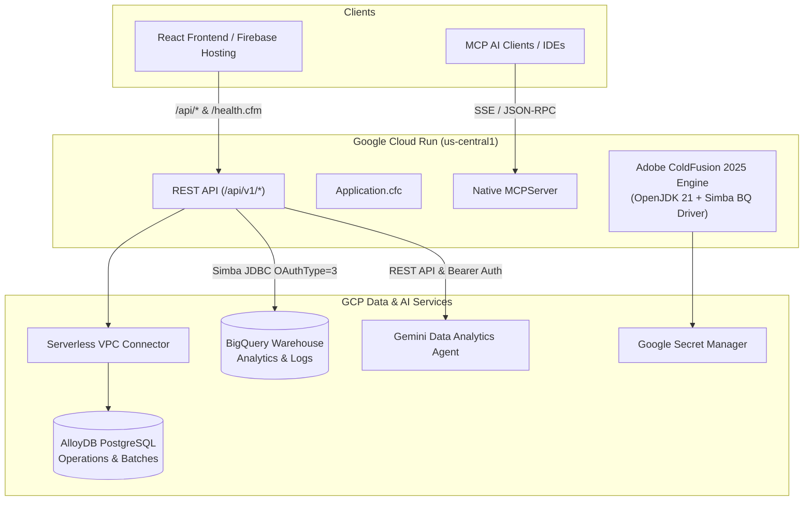

# 🍻 CF-Brews Backend

> A serverless, enterprise-grade Adobe ColdFusion (ACF 2025) REST API and MCP server running on Google Cloud Run with AlloyDB, BigQuery, and Gemini AI.

[](https://www.adobe.com/products/coldfusion-family.html)
[](https://cloud.google.com/run)
[](https://cloud.google.com/alloydb)
[](https://cloud.google.com/bigquery)
[](https://deepmind.google/technologies/gemini/)

---

## 📖 Overview

**CF-Brews Backend** is the core backend microservice for the CF-Brews platform. Built with **Adobe ColdFusion 2025** on **OpenJDK 21**, it runs as a containerized serverless service on **Google Cloud Run**.

The backend serves REST API endpoints, queries relational data in **AlloyDB (PostgreSQL)**, runs analytical queries across **Google BigQuery** using JDBC, hosts a native **Model Context Protocol (MCP) Server**, and orchestrates natural language interactions with the **Google Gemini Data Analytics Agent**.

---

## 🏗️ Architecture & Integrations



---

## ✨ Key Capabilities

- 🍺 **Brewery Operations API**: Endpoints for tracking active brews, recipe formulation, vat temperatures/capacity, and ingredient inventory.
- 🤖 **Native Model Context Protocol (MCP) Server**: Exposes custom ColdFusion tools to MCP-compatible AI clients and assistants via `api/v1/agent/mcp-server.cfm`.
- 🧠 **Gemini Data Analytics Integration**: Interfaces with Google's Gemini Data Agent for natural language-to-SQL translation, insights extraction, and conversational troubleshooting.
- ⚡ **Hybrid Storage & Analytics**:
  - **AlloyDB (PostgreSQL)** for low-latency operational data and vector embeddings.
  - **BigQuery** (via Simba JDBC 4.2 driver with Cloud Run Service Account auth) for high-scale analytical queries.
- 🛡️ **Zero-Trust & Cloud Native**: VPC Connector for private database egress, Secret Manager integration, and HTTP/1.1 client tuning for Cloud Run resilience.

---

## 📁 Repository Structure

```text
cf-brews-backend/
├── api/
│   └── v1/
│       ├── agent/           # Gemini Chat & MCP Server handlers (mcp-chat.cfm, mcp-server.cfm)
│       ├── analytics/       # Historical batch & performance analytics
│       ├── dashboard/       # Aggregated KPIs and live status metrics
│       ├── datagenerator/   # Synthetic data generators & seed scripts
│       ├── graph/           # Graph-based relationship queries
│       ├── ops/             # Core brewery operations (batches, recipes, vats, inventory)
│       ├── predict/         # AI predictive modeling endpoints
│       ├── search/          # Semantic & keyword brewery search
│       ├── stats/           # Operational statistics & metrics
│       ├── system/          # Environment diagnostics & status checks
│       └── tools/           # NativeBrewMasterTools.cfc (MCP tool definitions)
├── Application.cfc          # Datasource initialization, CORS, MCP Server lifecycle
├── Dockerfile               # Production container definition (ACF 2025 + OpenJDK 21 + BQ Driver)
├── cloudbuild.yaml          # GCP CI/CD deployment configuration
├── gemini_data_agent_setup.md # Detailed guide for Vertex & Gemini Data Agent setup
├── health.cfm               # Cloud Run startup & liveness probe endpoint
└── index.cfm                # Service landing page & metadata
```

---

## 📡 API Reference Overview

All API endpoints return JSON and handle CORS preflight requests automatically.

| Endpoint Group | Base Path | Description |
| :--- | :--- | :--- |
| **Health Check** | `/health.cfm` | Liveness & startup probe returning HTTP 200 `OK`. |
| **Operations** | `/api/v1/ops/` | `get-batches.cfm`, `create-batch.cfm`, `get-recipes.cfm`, `get-vats.cfm`, `get-inventory.cfm` |
| **Natural Language** | `/api/v1/ops/natural-query.cfm` | Converts natural language user prompts to executed database queries. |
| **Data Agent** | `/api/v1/ops/query-data-agent.cfm` | Proxies queries directly to the published Gemini Data Analytics Agent. |
| **MCP Server** | `/api/v1/agent/mcp-server.cfm` | Native ColdFusion Model Context Protocol endpoint for AI tool calling. |
| **Dashboard** | `/api/v1/dashboard/` | High-level KPI aggregations for frontend dashboards. |
| **Predictions** | `/api/v1/predict/` | Predictive insights for fermentation timing and demand. |

---

## ⚙️ Environment Variables & Secrets

The service retrieves configuration via environment variables and Google Secret Manager:

| Variable / Secret | Source | Purpose |
| :--- | :--- | :--- |
| `GOOGLE_CLOUD_PROJECT` | Env Var | GCP Project ID for BigQuery and Gemini API calls. |
| `GOOGLE_CLOUD_REGION` | Env Var | Deployment region (e.g., `us-central1`). |
| `DB_IP` | Secret (`alloydb-ip`) | Private IP address of the AlloyDB / PostgreSQL instance. |
| `DB_USER` | Secret (`alloydb-user`) | Database username. |
| `DB_PASS` | Secret (`alloydb-pass`) | Database password. |
| `ALLOYDB_CA_DATA_AGENT_ID` | Secret (`alloydb-ca-data-agent-id`) | Published Gemini Data Analytics Agent ID (e.g. `agent_{UUID}`). |
| `AI_STUDIO_API_KEY` | Secret / Env Var | Google AI Studio / Gemini API Key for direct model calls. |
| `password` | Secret (`cf-admin-password`) | ColdFusion Administrator password. |

---

## 🐳 Local Development with Docker

### Prerequisites

- [Docker Desktop](https://www.docker.com/) installed and running
- Access to the required database (or a local PostgreSQL container)

### Building and Running the Container

1. Build the Docker image:
   ```bash
   docker build -t cf-brews-backend:latest .
   ```

2. Run the container locally:
   ```bash
   docker run -d \
     -p 8500:8500 \
     -e acceptEULA=YES \
     -e GOOGLE_CLOUD_PROJECT=your-gcp-project-id \
     -e DB_IP=host.docker.internal \
     -e DB_USER=postgres \
     -e DB_PASS=yourpassword \
     --name cf-brews-backend \
     cf-brews-backend:latest
   ```

3. Verify the service is healthy:
   ```bash
   curl http://localhost:8500/health.cfm
   ```

---

## 🚢 CI/CD & Deployment

Deployments are fully automated using **Google Cloud Build**:

```bash
gcloud builds submit --config=cloudbuild.yaml
```

The pipeline defined in [`cloudbuild.yaml`](cloudbuild.yaml) performs:
1. **Docker Build**: Compiles the image with OpenJDK 21, `cfpm` modules, and Simba BigQuery drivers.
2. **Artifact Registry Push**: Tags and pushes the image to `${_REGION}-docker.pkg.dev/${PROJECT_ID}/cf-app-repo/cf-brews:latest`.
3. **Cloud Run Deploy**: Deploys the container with CPU boost, VPC egress connector, Secret Manager bindings, and custom startup health probes.

---

## 🤝 Related Repositories

- [cf-brews-frontend](https://github.com/SnipeTHH/cf-brews-frontend): React 18 & Tailwind CSS dashboard hosted on Firebase Hosting.
